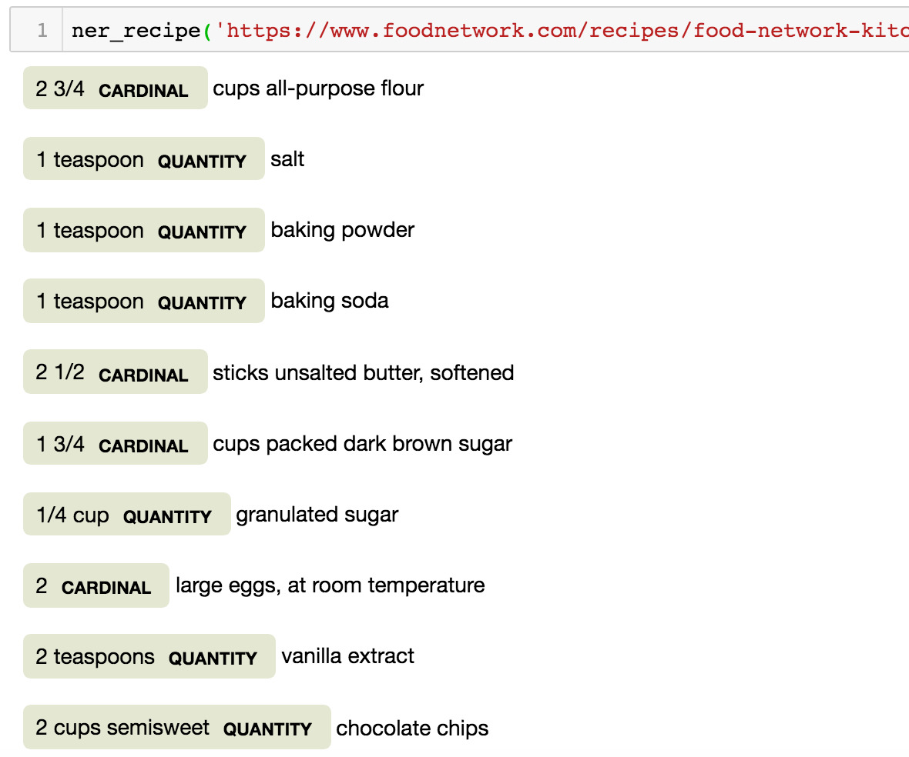
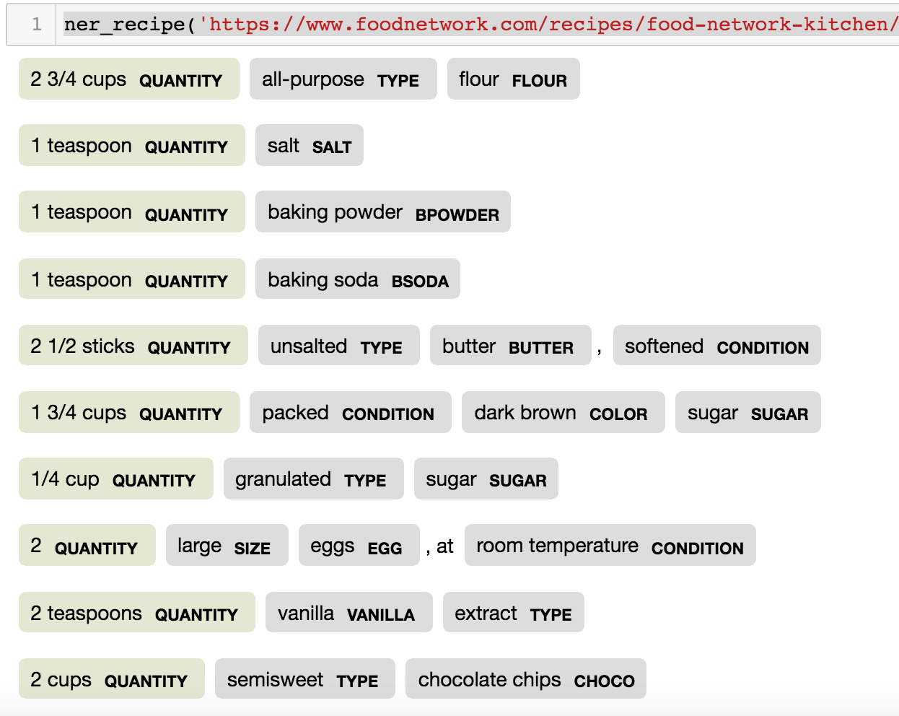

<h3><i>Keywords: NLP, Named Entity Recognition, Python, Baking</i></h3>

I am a beginner baker, and the first recipe I wanted to try was a chocolate chip cookies recipe. Chewy chocolate chip cookies are my all-time favorite. I found tons of recipes online that all claim to be the best, ultimate, and perfect recipes you would ever need. I randomly picked one that seemed promising, but I was not very happy with the results. After several attempts, I came up with the idea: what if I wrote some codes and let the computer make a recipe for me?

The basic idea is to first scrape ‘best’ chocolate chip cookies recipes from different web pages. Then, I build a custom Named Entity Recognition model using spaCy to extract information. The information is organized in Pandas DataFrame. Finally, an ‘average’ best chewy chocolate chip cookies recipe will be calculated.

<h3>Scrape Recipes from Food Network</h3>

The source for collecting recipes for this mini-project was the official website of the American <a href="https://www.foodnetwork.com/">Food Network</a> channel . The keywords for searching were ‘chewy chocolate chip cookies.’ I manually selected the recipes from the results based on the photo along with each recipe and the rating. (I could have selected the recipes solely by rating, but I did want to have a look at the goods to make sure they were something that I was actually looking for.) Beautiful Soup was used to parse and extract ingredient texts from each website. The texts were then written into two comma-separated values (CSV) files—one for the training data and the other for the testing data.

<h3>Build Custom Named Entity Recognition (NER) Model</h3>

The custom NER model was built on an existing pretrained spaCy NER model (using its library en_core_web_lg). The pretrained model can only recognize the QUANTITY entity type in the ingredient texts.

Therefore, I went through the data and decided to add the following additional entity types that were specific for chocolate chip cookies ingredients according to semantics:

-- 'BPOWDER','BSODA', 'BUTTER', 'TYPE', 'CONDITION', 'CHOCO', 'EGG', 'SIZE', 'FLOUR', 'QUALITY', 'SALT', 'USAGE', 'SUGAR', 'COLOR', 'VANILLA'

Something to pay attention to was how the existing pretrained NER model labeled the quantity entity in a piece of text. It sometimes was not able to correctly recognize the span for QUANTITY in the recipe, for example: [2] QUANTITY sticks butter. Then I manually changed the annotation these instances in the training data.

Annotating the custom entities can be time-consuming, and it was. So I wrote a separate script to add the annotation of the new entity types in the training data. I did check the annotation after running the script to make sure the correct spans were annotated, for example annotation for stem words (e.g. ’salted’ and ‘unsalted’).

The tutorial for adding additional entity types to a pretrained NER model can be found on <a href="https://spacy.io/usage/training#example-new-entity-type">spaCy’s website</a>. I trained the model with the data scraped from Food Network several times. When I first tested the model with the test data, I found incorrect annotation and misses. That was when I realized I might have some incorrect annotation in the training data. I also experienced (I think) something called the ‘catastrophic forgetting’ problem—basically the new model forgot the old entities from the pretrained model. So I went back to the training data to add the annotation for the QUANTITY entity.

After some changes, the model was able to make accurate recognition. With custom entity labels, looks like this

<h3>Get and Clean Results</h3>

When the model was ready, I used the model to recognize entities in the recipes I scraped separately from additional ten webpages that claimed to make the best, ultimate, and perfect chewy chocolate chip cookies. Then, I wrote the recognition results to a CSV file and save it. 

In the following steps, I mainly worked with the data with Pandas DataFrame. I first went over the results to make sure there was no missing data or unexpected characters. When the data was ready, the math part came in.

Recipes online use different units to measure ingredients, which can be inconvenient, confusing, and imprecise. So I wrote a separate script to convert all the measurements used in ingredient texts to weight (gram). There are several ingredient weight charts available online that can be references for volume, ounces, and grams equivalencies for common ingredients.
